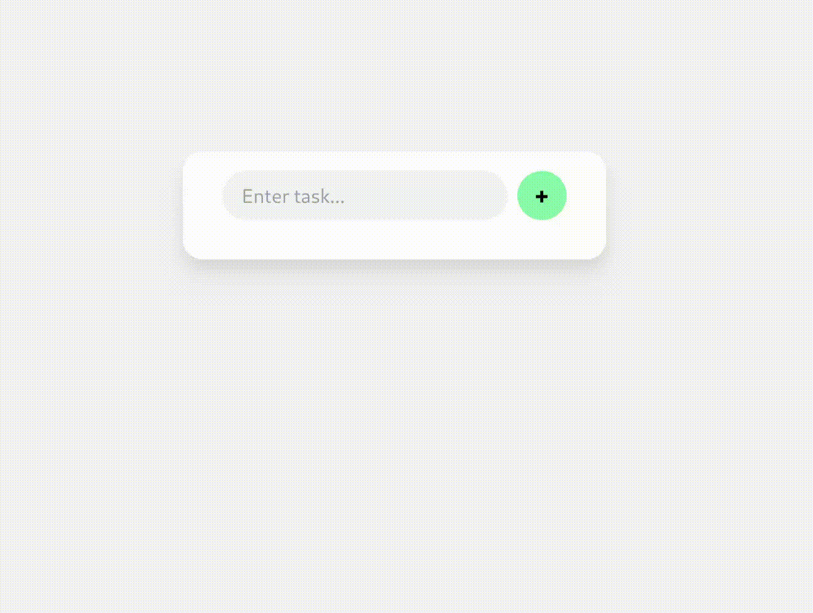

# Viz SeaOrm example

UI inspired by: https://github.com/HapticX/happyx/blob/master/examples/todo/README.md

## USAGE
sqlite use `in-memory`` mode,every time run the app, content reset!
```base
carog run
```

## FUNCTION IMPL

- [x] list
- [x] create
- [x] update
- [ ] delete

## SCREENSHOT



## FAQ
- libsqlite3 error: you need install libsqlite3 for your system

- sea-orm doc: https://www.sea-ql.org/sea-orm-tutorial/ch01-00-build-backend-getting-started.html
